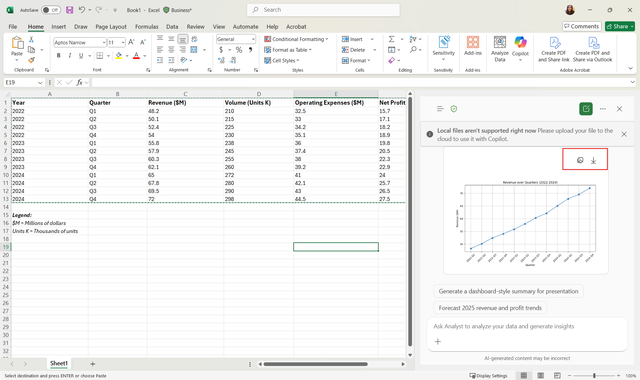

You're tasked with preparing a Q1 financial results presentation. Your goal is to analyze three years of revenue and volume data, generate insights using Copilot, and create a stakeholder-ready slide deck.

## Financial dataset (FY2022–FY2024)

| Year | Quarter | Revenue ($M) | Volume (Units K) | Operating Expenses ($M) | Net Profit ($M) |
|------|----------|---------------|------------------|--------------------------|-----------------|
| 2022 | Q1 | 48.2 | 210 | 32.5 | 15.7 |
| 2022 | Q2 | 50.1 | 215 | 33.0 | 17.1 |
| 2022 | Q3 | 52.4 | 225 | 34.2 | 18.2 |
| 2022 | Q4 | 54.0 | 230 | 35.1 | 18.9 |
| 2023 | Q1 | 55.8 | 238 | 36.0 | 19.8 |
| 2023 | Q2 | 57.9 | 245 | 37.4 | 20.5 |
| 2023 | Q3 | 60.3 | 255 | 38.0 | 22.3 |
| 2023 | Q4 | 62.1 | 260 | 39.2 | 22.9 |
| 2024 | Q1 | 65.0 | 272 | 41.0 | 24.0 |
| 2024 | Q2 | 67.8 | 280 | 42.1 | 25.7 |
| 2024 | Q3 | 69.5 | 290 | 43.0 | 26.5 |
| 2024 | Q4 | 72.0 | 298 | 44.5 | 27.5 |

## Step 1: Open your workspace

1. Open Excel with your financial dataset (three years of revenue and volume data). You can use the dataset provided here if needed.
2. Open a new PowerPoint deck to build your presentation slides.
3. Use Snap Layouts to arrange Excel and PowerPoint side by side so you can work between programs easily.

---

## Step 2: Prompt Copilot in Excel

1. Select the **Copilot icon** on the Home Ribbon.
1. In the Copilot sidebar, select the hamburger menu to open the list of available agents. Then choose **Analyst**.

3. Enter a clear prompt, for example:

- Calculate growth metrics:
   - `"Calculate CAGR for Revenue and Volume from 2022 to 2024."`
   - `"Calculate Year-over-Year % change for each quarter."`

- Generate textual insights:
   - `"Summarize trends and higlight key insights for executives."`
   - `"Identify top-performing quarters and regions."`

- Create charts:
   - `"Generate a line chart for Revenue over the last three years."`
   - `"Generate a bar chart for Volume by quarter."`

4. Press **Enter**. Copilot provides:  
   - Calculated CAGR for revenue and volume
   - YoY percentage changes  
   - A textual summary of trends

> [!NOTE]
> Copilot might ask a few follow-up questions to better understand your request. Answer these to help it generate accurate output.

## Step 3: Review and refine insights

1. Check Copilot’s calculations for accuracy.  
2. To refine results, use other prompts like:  
   - `"Summarize key trends in 2-3 sentences for executives."`  
   - `"Add a bulleted list of top performing regions."`

### Sample insights generated by Copilot

- Revenue growth: Revenue increased from USD48.2M in Q1 2022 to USD72.0M in Q4 2024.
- CAGR (Revenue): approx. 14.6%
- Volume growth: Volume increased from 210K units to 298K units over the same period.
- CAGR (Volume): approx. 12.4%
- Trend summary: Revenue growth slightly outpaces volume growth, suggesting improved pricing or product mix. Net profit margin remains steady around 35-38%.

## Step 4: Generate graphs

1. Ask Copilot to create graphs for visual representation:  
  `"Generate a line chart for revenue over the last 3 years and a bar chart for volume."`

 
2. Verify **chart titles, axis labels, and legends**. You can use prompts to further customize the charts. For example, "Make the bars in our graph purple."

## Step 5: Transfer graphs and insights to PowerPoint

1. Copy or download the graphs from Excel.

2. Paste the graphs into the corresponding **PowerPoint slides**.  
3. Add **Copilot-generated textual insights** below or next to each graph.

## Step 6: Refine presentation with Copilot

1. Select the **Copilot icon** in PowerPoint.  

2. Enter prompts like:  
   - `"Summarize the charts into concise bullet points for executives."`  
   - `"Rewrite insights in a professional and clear tone."`  

3. Review the suggestions and integrate them into your slides.

## Step 7: Final review checklist

- Are **CAGR** and **YoY** calculations correct?  
- Are **charts clear and labeled appropriately**?  
- Are **insights actionable and easy to understand**?  
- Is **slide layout logical and visually consistent**?  
- Are **recommendations highlighted** for stakeholder decision-making?