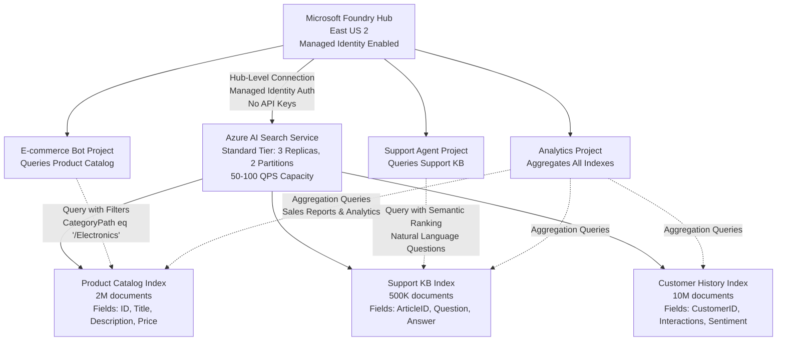

## The cost and complexity challenge of dedicated search

When organizations first adopt AI applications, teams provision separate Azure AI Search instances for each project—one for the customer support chatbot, another for the product recommendation engine, and a third for the knowledge management system. This pattern creates three immediate problems. First, costs multiply unnecessarily: five projects each deploying a Basic tier search instance at **$75** per month generate **$375** in monthly charges when a single Standard tier instance at $250 could serve all five projects with capacity to spare. Second, operational overhead scales linearly with instance count: your operations team monitors performance metrics, applies service updates, and reviews diagnostic logs across five separate services instead of one centralized instance. Third, configuration drift emerges as teams independently adjust query timeouts, scoring profiles, and index schemas without cross-project coordination.

Hub-level shared connections eliminate these problems by connecting one Azure AI Search service to the hub, making it available to all child projects through inherited configuration. With this approach, your five projects query the shared search service using the hub's managed identity for authentication, eliminating the need to distribute and rotate API keys across project code. At the same time, each project maintains logical isolation through separate search indexes: the chatbot project queries the Support Knowledge Base index, the recommendation engine queries the Product Catalog index, and teams never access each other's data despite using the same underlying service.

## Establishing hub-level search connections

Before connecting Azure AI Search to your hub, provision a search service in the same Azure region as the hub to minimize query latency. Select a pricing tier based on aggregate capacity needs across all projects: a Standard tier with 3 replicas and 2 partitions typically supports 50-100 queries per second, sufficient for most enterprise deployments with multiple projects. Building on this foundation, navigate to your hub in the Microsoft Foundry Portal and select **Connected resources** from the left navigation menu. Select **Add connection**, choose **Azure AI Search** from the service catalog, and provide the search service's endpoint URL (https://yourservice.search.windows.net).

For example, when configuring authentication, select **Managed identity** rather than API key authentication. This choice instructs Azure to use your hub's system-assigned managed identity to authenticate all search operations, eliminating credential management overhead. After you save the connection, Azure automatically assigns the Search Index Data Reader and Search Service Contributor roles to your hub's managed identity on the target search service. These role assignments permit projects to query indexes, retrieve documents, and create new indexes while preventing them from deleting the search service itself or modifying network configurations.

With the connection established, validate access from a project workspace. Create a new project within the hub, navigate to the project's **Connections** page, and confirm that the Azure AI Search connection appears in the inherited connections list. This inheritance means project teams don't configure search connectivity—they simply reference the hub-level connection in their code and start building search-enabled AI applications immediately. This becomes especially important when you need to rotate search credentials or migrate to a different search service: update the connection once at the hub level, and all projects automatically use the new configuration without code changes.

## Organizing indexes for multi-project access

Now that your hub shares a search service across projects, establish index organization conventions that prevent conflicts and maintain logical separation. Create separate indexes for each project's distinct data domain: customer_support_kb for the chatbot project, product_catalog_v2 for the recommendation engine, and employee_directory for the HR analytics project. Include version suffixes in index names (v1, v2) to support blue-green deployment patterns where you test schema changes in a new index version before switching application traffic.

For example, suppose your Product Catalog index contains 2 million documents with fields like ProductID, Title, Description, Price, and CategoryPath. The recommendation engine project queries this index using filters like CategoryPath eq '/Electronics/Laptops' and facets on price ranges. At the same time, your Analytics project runs aggregation queries against the same index to generate sales reports, and your Chatbot project references product descriptions when answering customer questions about availability. All three projects share the underlying 2-million-document index, yet each maintains separate query logic and result processing pipelines.

Implement Azure AI Search's security trimming features when different projects should access different subsets of data within the same index. Add a ProjectAccess field to each document containing a comma-separated list of project IDs authorized to view that document. Configure a security filter in each project's search queries: filter=ProjectAccess/any(p: p eq 'chatbot-prod') ensures the chatbot project only retrieves documents marked for its access. This approach reduces index duplication while maintaining data isolation guarantees—critical when your organization's data classification policy requires different projects to access Public versus Internal versus Confidential information.

:::image type="content" source="../media/implement-azure-search-security-trimming.png" alt-text="Diagram showing how to implement Azure AI Search's security trimming features.":::

## Capacity planning and performance optimization

Building on your multi-project index strategy, monitor aggregate query patterns to right-size your shared search service. Azure AI Search reports queries per second (QPS), average query latency, and throttled request counts at the service level. When your monitoring dashboard shows consistent query latency above 200 milliseconds or throttling during peak hours, consider scaling vertically to a higher tier (Standard to Standard 2) or horizontally by adding replicas. Adding a replica distributes query load across more compute resources, reducing latency by 30-50% for read-heavy workloads common in AI search scenarios.

For example, consider what happens when your chatbot project launches to 5,000 concurrent users, each generating 2 search queries per session. This sudden load spike increases your shared search service QPS from 20 to 120, potentially degrading response times for all projects using the service. Implement autoscaling rules that add replicas when average QPS exceeds 80 for 10 consecutive minutes and remove replicas when QPS drops below 30 for 30 minutes. These dynamic adjustments maintain sub-100-millisecond query latency during traffic spikes while controlling costs during off-peak hours.

With capacity monitored, optimize query performance through index-specific tuning. Enable suggestions on frequently searched fields (Title, Description) to support autocomplete features in your chatbot interface. Configure semantic ranking for the Support Knowledge Base index to improve answer relevance when users ask natural language questions. Create synonym maps that treat domain-specific terms equivalently (laptop/notebook, cellphone/mobile) to increase search recall without requiring users to know exact product terminology. These optimizations benefit all projects sharing the index, compounding the value of centralized search infrastructure.

:::image type="content" source="../media/capacity-monitor-optimize-query-performance.png" alt-text="Diagram showing capacity monitored to optimize query performance through index-specific tuning.":::

## Connection troubleshooting and monitoring

Now that you understand shared connection architecture and optimization, prepare for common troubleshooting scenarios. When projects report "Access denied" errors querying the shared search service, verify that the hub's managed identity still holds Search Index Data Reader role assignments on the target service. Role assignments occasionally expire or get removed during organizational RBAC reviews, breaking project access. Navigate to the search service's **Access control (IAM)** blade in Azure portal, search for your hub's managed identity name, and confirm the role assignment exists with no expiration date.

For example, suppose network connectivity issues prevent projects from reaching the shared search service. Use Azure Network Watcher to validate that traffic flows from the hub's virtual network subnet to the search service's private endpoint. If your hub uses public network access, confirm that the search service's firewall settings include the hub's outbound IP addresses in the allowed IP ranges list. Network misconfigurations often surface when organizations migrate hubs from public to private endpoint mode without updating corresponding firewall rules on connected services.

Enable diagnostic logging on both the hub and the search service to build comprehensive audit trails. Configure the hub to send logs to a Log Analytics workspace, capturing project creation events, connection modifications, and RBAC changes. Configure the search service to log query operations, index updates, and authentication failures to the same workspace. With unified logging in place, your operations team uses Kusto Query Language (KQL) to correlate hub activity with search performance: identify which project's query pattern caused a latency spike, determine whether failed authentication attempts indicate a misconfigured managed identity, and generate compliance reports showing all data access across shared infrastructure.

:::image type="content" source="../media/hub-level-azure-search-connection-architecture.png" alt-text="Diagram showing hub-level Azure AI Search connection architecture.":::

*Hub-level Azure AI Search connection architecture showing one Standard tier search service with three project-specific indexes shared across three projects using managed identity authentication*

Alt text: Architecture diagram illustrating hub-level shared Azure AI Search infrastructure. Microsoft Foundry Hub in East US 2 region with managed identity enabled connects to Azure AI Search Service via labeled connection showing managed identity authentication eliminates API keys. Search service node displays Standard tier capacity of 3 replicas and 2 partitions supporting 50-100 queries per second. Search service contains three child index nodes: Product Catalog Index with 2 million documents including ID, Title, Description, Price fields; Support KB Index with 500,000 documents including ArticleID, Question, Answer fields; Customer History Index with 10 million documents including CustomerID, Interactions, Sentiment fields. Hub connects downward to three project nodes: E-commerce Bot Project, Support Agent Project, and Analytics Project. Dotted query lines show E-commerce Bot querying Product Catalog with filters on CategoryPath electronics, Support Agent querying Support KB with semantic ranking for natural language questions, and Analytics Project querying all three indexes with aggregation queries for sales reports. Architecture demonstrates single shared search service instance provisioned at hub level serving multiple projects with logical isolation through separate indexes.

## Additional resources

- [Azure AI Search security and access control](/azure/search/search-security-overview) - Managed identity authentication and RBAC role requirements
- [Monitor Azure AI Search query performance](/azure/search/search-performance-analysis) - QPS metrics, latency analysis, and scaling guidance

## Enhancement suggestions

- Screenshot of Microsoft Foundry Portal showing hub's Connected resources page with Azure AI Search entry displayed. Entry shows fields for Service name (contoso-search-prod), Endpoint URL (https://contoso-search-prod.search.windows.net), Authentication method (Managed Identity - Enabled with green checkmark), Date connected (2025-01-10), and expandable section labeled 'Projects with access' showing bulleted list of three project names: E-commerce Bot (queries Product Catalog index), Support Agent (queries Support KB index), Analytics Dashboard (queries all indexes).
- Screenshot of Azure portal displaying Azure AI Search resource's Access control (IAM) blade. Search box at top shows query 'contoso-hub-prod-identity'. Results section highlights two role assignments: (1) Search Index Data Reader role assigned to contoso-hub-prod-identity system-assigned managed identity with scope 'This resource', (2) Search Service Contributor role assigned to same managed identity. Annotation callout points to role assignments with text '50-70% cost reduction through consolidated search infrastructure and simplified credential management'.
- Three-minute demonstration video showing complete hub-level Azure AI Search connection workflow: Administrator navigates to Microsoft Foundry Portal, selects hub settings, clicks Add connected resource, chooses Azure AI Search from service catalog, enters search service endpoint URL, toggles authentication to Managed Identity mode, saves connection. Video then switches to project workspace view showing inherited connection appearing automatically in project's Connections list. Final segment displays Azure portal showing automatic RBAC role assignments on search service. Voiceover explains each step and highlights cost savings compared to per-project provisioning.
- Interactive troubleshooting simulator presenting five common Azure AI Search connection failures with realistic error messages: (1) 'Authentication failed: Managed identity lacks required permissions' showing missing Search Index Data Reader role, (2) 'Network blocked: No route to host' showing private endpoint DNS misconfiguration, (3) 'Throttling error: Query rate limit exceeded' showing need to add replicas, (4) 'Index not found: blogs-index' showing typo in index name, (5) 'Access denied: Insufficient RBAC permissions' showing project team member lacking Cognitive Services User role. Learners select from three diagnostic actions per scenario (check RBAC roles, validate network connectivity, review index names) and receive immediate feedback with step-by-step remediation instructions.
- Cost calculator tool where learners input number of projects (5-50), expected queries per second (10-500), and search index size (1GB-1TB). Calculator compares three scenarios: (A) dedicated Basic search per project, (B) hub-level shared Standard search, (C) hybrid approach with shared + one dedicated. Output displays monthly cost breakdown, management time saved in hours per month, and recommended configuration with explanation of scaling thresholds.

## Accessibility notes

Mermaid diagram uses solid lines for hub-to-search connection labeled with authentication method details and dotted lines for project-to-index query patterns labeled with query types. Node labels include capacity specifications (tier, replicas, partitions, QPS) and document counts ensuring screen readers convey scale information. Comparison table provides structured textual cost analysis with specific dollar amounts and operational overhead descriptions suitable for assistive technology.
