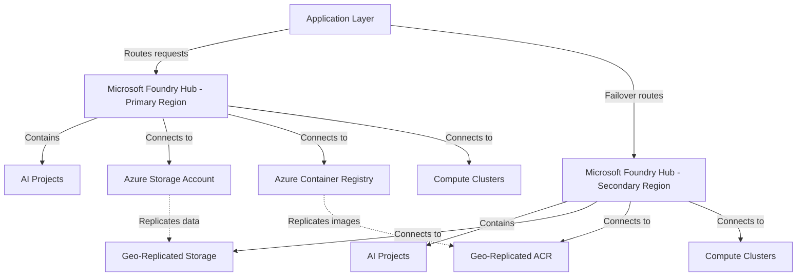

When you create a Microsoft Foundry hub, you establish the control plane for all AI projects, compute resources, and model registries in a specific Azure region. The hub acts as the organizational boundary where you define governance policies, manage access control, and coordinate resources across multiple AI projects. For production workloads, a single-region hub creates a critical dependency—if that region becomes unavailable, your entire AI infrastructure stops functioning until the outage resolves.

With multi-region hub deployment, you create independent hubs in geographically separated Azure regions that can operate autonomously. Your primary hub in East US handles normal production traffic while a secondary hub in West US remains ready to accept requests if the primary region fails. Unlike traditional disaster recovery where you manually rebuild infrastructure after an outage, this approach keeps both hubs operational and synchronized, enabling automatic failover when your application layer detects primary hub unavailability. Building on this foundation, you need to understand how hubs connect to dependent resources and what happens during regional transitions.

:::image type="content" source="../media/enable-automatic-failover-application-layer.png" alt-text="Diagram showing how enabling automatic failover when the application layer detects primary hub unavailability.":::

## Hub architecture and dependent resources

Each Microsoft Foundry hub requires connections to three core Azure services: a storage account for training datasets and experiment artifacts, a container registry for custom model images, and compute clusters for training and inference workloads. When you create a hub, you either select existing resources in the same region or let Azure provision new ones automatically. These dependencies become critical during multi-region design because your secondary hub needs access to replicated copies of training data and container images to maintain functionality during failover.

The hub itself doesn't replicate data between regions—that responsibility belongs to the underlying storage and registry services. Your hub configuration specifies which storage account and container registry to use, and during a regional failover, your application redirects inference requests to the secondary hub, which then accesses its own regional replicas of storage and container images. This separation of concerns means you configure replication at the resource level (covered in the next two units) while the hub layer provides the AI-specific control plane that coordinates these resources.

## Deployment patterns for production resilience

Three deployment patterns address different availability requirements and cost constraints. A single-region hub provides 99.9% availability based on Azure's service-level agreement for individual components, suitable for development environments where temporary unavailability during regional outages is acceptable. With this approach, recovery requires manual intervention to recreate resources in a different region and restore data from backups, typically taking several hours.

Active-passive deployment creates a secondary hub in a standby region with replicated storage and container images but minimal or no compute resources provisioned until failover occurs. This pattern achieves 99.95% availability by maintaining infrastructure readiness while optimizing costs—you only pay for compute in the secondary region when you scale up during an outage. Your application layer monitors primary hub health and switches traffic to the secondary hub when it detects failures, then provisions compute resources on demand to handle the redirected workload.

Active-active deployment runs production workloads simultaneously across both hubs with full compute capacity in each region. This pattern delivers 99.99% availability and reduces latency for global users by routing requests to the nearest hub, but costs double because you maintain full infrastructure in both regions continuously. Organizations choose this pattern when they need geographic load distribution for regulatory compliance, data residency requirements, or minimal-latency access from multiple continents. At the same time, active-active increases operational complexity because you must coordinate model deployments and configuration changes across both hubs to maintain consistency.

:::image type="content" source="../media/geographic-load-distribution-regulatory-compliance.png" alt-text="Diagram showing how the active-active approach increases operational stability.":::

## Failover routing and application integration

Your application layer handles failover logic by implementing health checks that periodically test primary hub availability through API endpoints or Azure Monitor alerts. When health checks fail for a configurable threshold (typically three consecutive failures over five minutes), the application updates its endpoint configuration to route new inference requests to the secondary hub. Existing in-flight requests to the primary hub may fail, so your client code should implement retry logic with exponential backoff to handle transient failures gracefully.

During failover, the secondary hub uses its connections to geo-replicated storage and container registry to serve requests without requiring data synchronization. However, any training jobs or experiments running in the primary region at the time of failure won't automatically resume in the secondary region—you must manually resubmit those jobs if they're critical to complete. This becomes especially important when planning maintenance windows or testing failover procedures, because you need to account for work-in-progress that may be lost during transitions. With this understanding of hub architecture and failover patterns, you're ready to examine how geo-redundant storage protects the training datasets and model artifacts that hubs depend on.

:::image type="content" source="../media/foundry-multi-region-hub-architecture.png" alt-text="Diagram showing how dependent resource connections and failover routing between primary and secondary regions.":::

*Microsoft Foundry multi-region hub architecture showing dependent resource connections and failover routing between primary and secondary regions*

Alt text: Architecture diagram showing two Microsoft Foundry hubs deployed in primary and secondary regions. The primary hub in the top section contains AI projects and connects to storage account, container registry, and compute clusters in the same region. The secondary hub in the bottom section mirrors this structure with its own AI projects and regional resources. Dotted lines show data replication flowing from primary storage to geo-replicated storage and from primary container registry to geo-replicated registry. An application layer at the bottom routes inference requests to the primary hub with a failover path to the secondary hub when needed.

## More resources

- [Microsoft Foundry hub management](/azure/ai-studio/how-to/create-azure-ai-resource) - Step-by-step guide for creating and configuring hubs with dependent resources
- [High availability architecture patterns](/azure/architecture/reference-architectures/ai/) - Reference architectures for multi-region AI deployments

