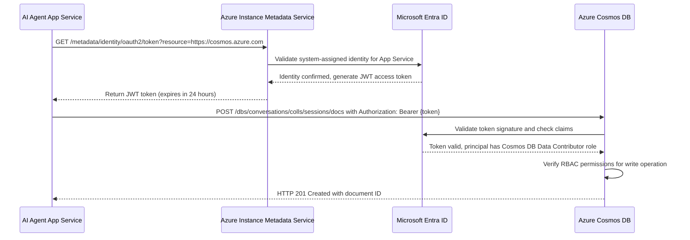

You've just configured RBAC roles to grant your AI agent precise permissions for reading conversation history from Cosmos DB. However, the agent still needs a way to prove its identity when making API calls—traditionally accomplished by storing a connection string or access key in application configuration. This approach creates immediate security risks: developers accidentally commit secrets to source control repositories, connection strings proliferate across configuration files in multiple environments, and operations teams spend hours rotating credentials quarterly to satisfy compliance audits. Microsoft security research shows that 60% of cloud security incidents involve compromised credentials, with an average breach detection time of 280 days.

Microsoft Entra ID Managed Identities eliminate credential storage entirely by providing your Azure resources with automatically managed identities that can authenticate to any service supporting Entra ID authentication. Unlike traditional service principals that require manual creation and credential management, managed identities have their lifecycle tied directly to the Azure resource that uses them. When you enable a system-assigned managed identity on an App Service, Azure automatically provisions an identity in your Entra ID tenant, manages its credentials behind the scenes, and rotates the underlying certificate every 46 days without any action from your operations team.

With this approach, your AI agent application requests an access token at runtime from the Azure Instance Metadata Service (IMDS), an internal endpoint available to all Azure compute resources. The application makes an HTTP GET request to `http://169.254.169.254/metadata/identity/oauth2/token` specifying the target resource (for example, Cosmos DB), and IMDS validates that the calling resource has a managed identity enabled. After validation, Entra ID issues a short-lived JSON Web Token (JWT) that expires after 24 hours, and the agent includes this token in the Authorization header of subsequent API calls to Cosmos DB. The database validates the token's signature and claims with Entra ID, confirms the identity has appropriate RBAC permissions (remember that Cosmos DB Data Contributor role you assigned), and grants access to the requested data.

:::image type="content" source="../media/database-validate-token-signature-claims.png" alt-text="Diagram showing how a database validates a token signature and claim with Entra ID.":::

This becomes especially important when you compare the two types of managed identities available. System-assigned identities have their lifecycle bound to a single resource—when you delete the App Service, Azure automatically removes its managed identity. This tight coupling simplifies management for scenarios where one application needs access to specific resources, and it's the default choice for 85% of Azure deployments according to Microsoft telemetry. In contrast, user-assigned identities exist as standalone resources independent of any particular compute service, allowing you to assign the same identity to multiple App Services, Virtual Machines, or Azure Functions. This approach suits complex architectures where several services share the same set of permissions, such as a microservices platform where ten different APIs all need identical access to a central Cosmos DB account.

Consider what happens in your production environment after enabling a system-assigned managed identity on the customer support agent's App Service. You navigate to the **Identity** blade in the Azure portal, toggle the system-assigned status to **On**, and save the configuration. Azure immediately provisions an identity with a unique object ID and displays it in the portal. You then assign the Cosmos DB Data Contributor role to this identity using the Access Control (IAM) workflow covered in the previous unit. With this configuration complete, your development team removes all connection strings from application configuration files and updates the agent's code to request tokens from IMDS before calling Cosmos DB APIs.

:::image type="content" source="../media/development-team-removes-connection-strings.png" alt-text="Diagram showing how a development team removes all connection strings from application configuration files.":::

Building on this foundation, your application benefits from automatic credential rotation without code changes or deployment cycles. Traditional connection string rotation requires coordinating updates across multiple configuration files, restarting services during maintenance windows, and verifying connectivity after each change—a process that typically takes 3-4 hours per environment and introduces risk of service disruption. With managed identities, Azure handles rotation transparently, and your application seamlessly acquires new tokens using the same IMDS endpoint. Operations teams report that this automation reduces credential management overhead by 90% while improving security posture by eliminating the most common attack vector for cloud data breaches.

Now that you understand how managed identities provide keyless authentication through automatic token acquisition, you're ready to configure the data store that will persist your AI agent's conversations. The next unit explores deploying Azure Cosmos DB for NoSQL with optimized partition keys, consistency levels, and retention policies that balance performance with compliance requirements.

:::image type="content" source="../media/keyless-authentication-flow-system-assigned.png" alt-text="Diagram showing eight steps in the keyless authentication flow.":::

*Keyless authentication flow using system-assigned managed identity and Azure Instance Metadata Service to write conversation data*

Alt text: Sequence diagram showing eight steps in the keyless authentication flow: 1) AI Agent App Service sends HTTP GET request to Azure Instance Metadata Service requesting an access token for Cosmos DB resource, including the resource parameter set to https://cosmos.azure.com. 2) IMDS sends validation request to Microsoft Entra ID to confirm the App Service has a system-assigned managed identity enabled. 3) Entra ID confirms identity is valid and generates a JWT access token with appropriate claims and 24-hour expiration. 4) IMDS returns the JWT token to the agent application. 5) Agent makes HTTP POST request to Cosmos DB to create a new conversation document, including the token in the Authorization header as Bearer authentication. 6) Cosmos DB sends token to Entra ID to validate the signature and extract claims including the principal identity. 7) Entra ID confirms token is valid and returns the principal's role assignments, showing Cosmos DB Data Contributor permissions. 8) Cosmos DB verifies the principal has write permissions through RBAC and returns HTTP 201 Created response with the new document ID.

## Additional resources

- [How to use managed identities for App Service and Azure Functions](/azure/app-service/overview-managed-identity) - Detailed guide for enabling and using managed identities in App Service with code samples in multiple languages
- [Authenticate and authorize with managed identities in Azure Cosmos DB](/azure/cosmos-db/how-to-setup-rbac) - Instructions for configuring role-based access control for Cosmos DB using managed identities instead of connection strings
- [Azure Instance Metadata Service (IMDS)](/azure/virtual-machines/instance-metadata-service) - Technical reference for the IMDS endpoint including request formats, response schemas, and token acquisition examples

## Enhancement suggestions

- Screenshot of Azure portal showing the Identity blade of an App Service resource with the System assigned tab selected. The Status toggle should be set to On with a green indicator and checkmark. The Object (principal) ID field should display a sample GUID like 'a1b2c3d4-e5f6-7890-abcd-ef1234567890' to show the managed identity's unique identifier. The Azure resource ID field should show the full resource path. Include callout number 1 pointing to the Status toggle and number 2 pointing to the Object ID field with a label explaining 'This ID is used when assigning RBAC roles.'
- Screenshot showing sample application code or Azure CLI command demonstrating token acquisition from IMDS. For example, a Python code snippet using the requests library to call the IMDS endpoint with appropriate headers including 'Metadata: true' and the resource parameter. The response JSON should show the access_token, expires_on timestamp, and resource fields. Include syntax highlighting and a caption explaining that this code runs inside the Azure resource with managed identity enabled.
- Four-minute demonstration video showing the complete process of enabling a system-assigned managed identity on an App Service, assigning the Cosmos DB Data Contributor role to that identity through the Access Control (IAM) blade, and then viewing the Activity Log to verify the role assignment event. Video should include voice-over explaining the automatic token acquisition process and how the application code uses the IMDS endpoint without storing any credentials.
- Three-minute animated explainer video illustrating the token acquisition and validation flow with visual representations of the HTTP requests between agent, IMDS, Entra ID, and Cosmos DB. Animation should highlight the JWT token structure showing header, payload with claims, and signature components, with labels explaining how each part contributes to secure authentication.
- Interactive managed identity configuration simulator where learners choose between system-assigned and user-assigned identity types, select target resources (Cosmos DB, Key Vault, Storage Account), assign appropriate RBAC roles, and observe a visual representation of the resulting authentication flow. Tool should provide feedback on configuration choices and highlight security best practices versus common mistakes.
- Hands-on token inspection tool where learners paste a sample JWT access token and the tool decodes and displays the header, payload claims (including principal object ID, resource audience, expiration time), and signature. Tool should include explanatory tooltips for each claim and show how Cosmos DB validates these claims during authorization.

## Accessibility notes

Sequence diagram uses labeled participant boxes at the top with clear names (AI Agent App Service, Azure Instance Metadata Service, Microsoft Entra ID, Azure Cosmos DB). Numbered arrows show request and response flow with descriptive labels including HTTP methods, endpoints, and key parameters. Alt text describes each interaction step in detail including the purpose of the request, the validation performed, and the content of each response. Comparison table uses left-aligned text with clear column headers and row labels, avoiding merged cells or complex formatting that might confuse screen readers.
