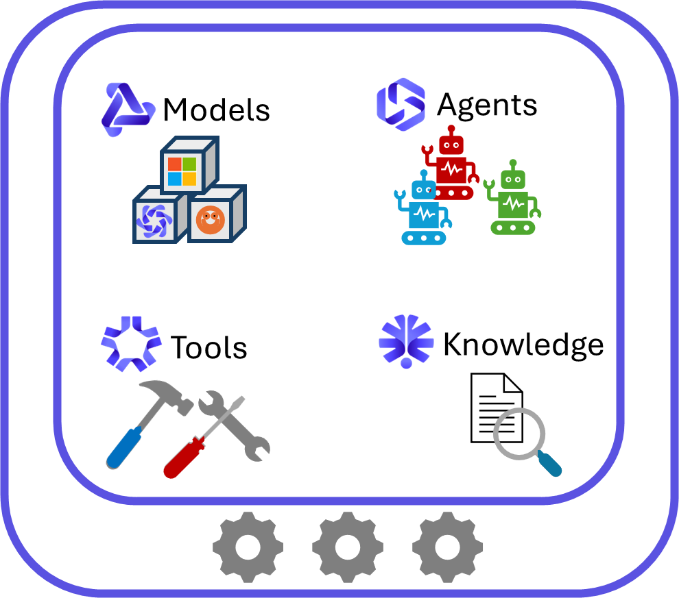
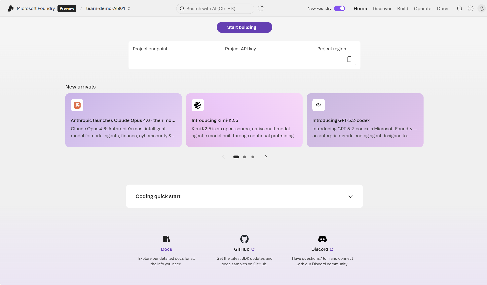
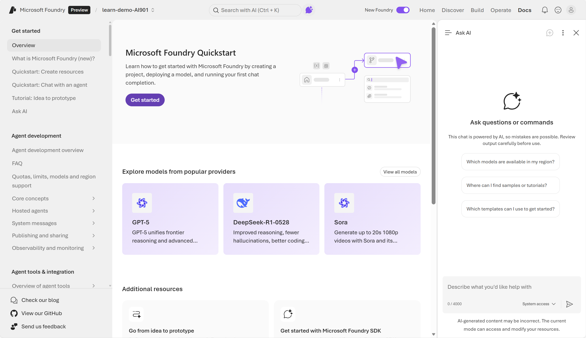
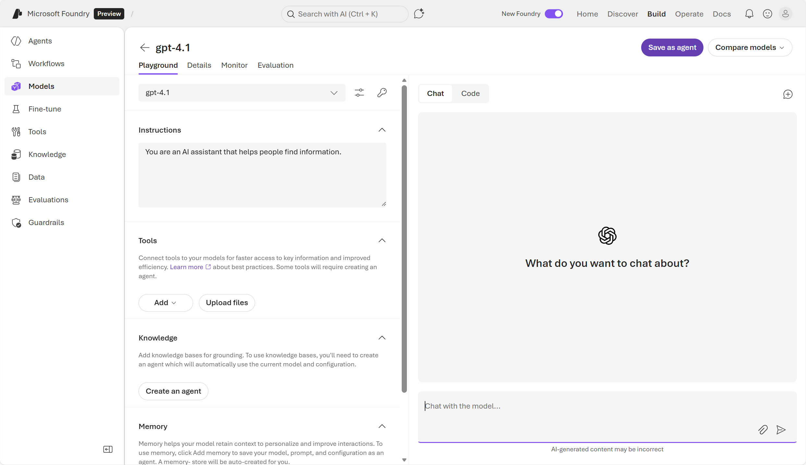

::: zone pivot="video"

>[!VIDEO https://learn-video.azurefd.net/vod/player?id=0837e22d-9cd5-4f96-a06a-1269b470a8e4]

::: zone-end

::: zone pivot="text"

**Microsoft Foundry** is a unified, enterprise-grade platform-as-a-service (PaaS) for building, deploying, and managing AI applications and agents. It consolidates models, agent orchestration, monitoring, and governance tools in one platform, offering production-grade infrastructure and security. 

Foundry offers powerful capabilities for developers, including the ability to choose from a wide range of **models**, use those models to build **agents**, connect those agents to **tools**, and integrate **knowledge** by using Foundry IQ, the centralized connection point for data sources.

#### Models 
Foundry supports thousands of models—including rich first-party, third-party, and open-source options—directly from its unified **model catalog**. Developers can access Azure-hosted OpenAI models such as the latest **GPT‑5 family** (GPT‑5, GPT‑5-mini, GPT‑5-nano, GPT‑5-chat/5.2-chat) with extensive multimodal and reasoning capabilities, alongside specialist models from Anthropic (e.g., Claude Opus 4.6/4.5, Sonnet), Mistral, Cohere, Meta LLaMA, DeepSeek, xAI’s Grok, Black Forest Labs, and gated (enterprise-governed) Hugging Face models. 

Users can browse thousands of models—ranging from massive foundation models to lightweight, domain-specific variants—evaluate them via built-in leaderboards and playgrounds, and manage deployments directly in Foundry. Full lifecycle support enables deployment per region, customizable deployment types (standard, provisioned, batch), version control, and governance support with Responsible AI and content safety. 

#### Agents
At the core of Microsoft Foundry is an agent‑first approach that lets developers build intelligent, task‑oriented agents directly within their Foundry projects. These agents can reason over inputs, call tools, interact with data, and automate workflows using the platform’s built‑in orchestration. Foundry handles the underlying coordination—including message threading, tool execution, safety controls, and observability—so developers can focus on designing the agent’s goals and capabilities. Using either low‑code or code‑first workflows, teams can create multi‑agent systems that work with project resources such as documents, datasets, search indexes, and connections to external systems, including integrations like Azure Functions or Microsoft Fabric.

#### Tools
Foundry offers a comprehensive suite of Azure services—such as speech, vision, language, document intelligence, and more. These Foundry Tools provide AI capabilities that can be built into web or mobile applications in a way that's straightforward to implement. There're over a dozen different services that can be used separately or together to add AI power to applications. For example, you could use Azure Vision to analyze images, Azure Language to summarize text, classify information, or extract key phrases, and Azure Speech to convert speech to text and text to speech.

#### Knowledge
Foundry IQ provides a permission‑aware, multi‑source knowledge layer that gives agents accurate, grounded answers using an organization’s own data. It lets you create a configurable knowledge base made up of internal and external knowledge sources—such as Azure Blob Storage, SharePoint, OneLake, or public web data—and automatically handles indexing, document chunking, vector embeddings, and metadata extraction. When an agent queries the knowledge base, Foundry IQ uses agentic retrieval to break the question into subqueries, search multiple sources in parallel, and return relevant, citation‑backed information while enforcing user permissions and Microsoft Purview sensitivity labels. This ensures that agents can draw from trusted, up‑to‑date content and only return information the user is authorized to see, providing a reliable knowledge foundation for enterprise AI workflows. 

The assets for your AI solution are organized within a project. Each project is contained within a Foundry resource, which provides model hosting and the services your apps and agents need in Azure.

## Foundry resources and projects

To get started with Foundry, you need to create a **Foundry resource**, which provides model hosting and the services your apps and agents need. You can create a Foundry resource in the Azure portal, Foundry portal, or programmatically with scripting. 

A Foundry resource is the *Azure resource* that provides the platform capabilities. A Foundry resource provides access to:

- Models (Microsoft, partner, and OpenAI‑compatible)
- Foundry’s agent service
- Deployment governance
- Monitoring & observability
- Security boundaries 
- Quotas and operational controls

A **Foundry project** is a *workspace* inside that resource where you build AI apps, agents, and evaluations. A Foundry Project lets you build and manage:

- Agents
- Evaluations
- Files and datasets
- Vector indexes
- Flows (AI logic)
- Connections
- Project‑specific settings

You might have one Foundry resource for a team or department, and many Foundry projects inside it, each focused on a separate AI use case.

## Foundry portal

The Foundry portal provides a modern web-based interface for developing, testing, and operating AI solutions. This is where you'll spend a lot of your time when working with models, agents, and other assets.

> [!NOTE]
> Foundry portal has a *classic* user interface (UI) and a *new* user interface. The two provide slightly different experiences for users. Choose the *new* portal for a seamless experience that combines simplicity with powerful and secure tools to build, manage and grow multi-agent applications. Only Foundry projects are visible here - use *classic* for all other resource types. Users can toggle back and forth between the classic and new interfaces as needed. 

In the *new* Foundry portal you can discover models and tools, build agents, manage the operation of those agents, and much more. At any time, you can get help with **Ask AI** agent helper. The *Ask AI* experience uses specialized sub‑agents to answer questions and help with tasks across Microsoft Foundry. It can guide you through documentation, explain model catalog capabilities, troubleshoot issues, and manage model deployments, quotas, and operations. It also compares and analyzes models, interprets monitoring dashboards, and supports end‑to‑end evaluation workflows for language models and agents.

#### Using Foundry portal for application development

When you're building applications on Azure, Foundry provides a powerful and versatile platform for development. A general name for applications (that may or may not have AI capabilities) is **client applications**. A client application is a program that a user interacts with on their device (like a phone, laptop, or browser) that sends requests to a server and displays the results.

Consider the following workflow for using Foundry portal to develop an AI application: 
  
1. Sign into Foundry portal using your Azure subscription and create a Foundry project. 
2. In Foundry, pick a model from the Model Catalog and deploy it.
    
3. In Foundry, experiment with the model in the Playground. You can use the Playground to write prompts, test model responses, configure parameters.
    
4. Use the configured model in your own client application. 

An AI client application utilizes a model, data, and application logic to process and return results. The app logic is the code or workflow that sends requests to the model, receives the response, and processes and transforms results. The entire process is known as a **client–server** interaction. A client-server system provides the foundation for how users interact with AI systems, how requests are processed, and how results are delivered.

Responsibilities of the **client**:

1. Present a UI or CLI
2. Collect user input (text, voice, images)
3. Format the input into a prompt or API request
4. Send a request to the server (model endpoint)
5. Display the returned output

The client requests the model for results, which is hosted by the **server**, or the *back end*. In Foundry, the server is your **model deployment**. 

Responsibilities of the **server**: 

1. Receive the prompt
2. Run inference on the model
3. Apply system instructions, safety, context, and more
4. Return the generated output (for example: text, image, audio, or structured JSON)

Next, let's take a look at how clients connect to to Foundry models and how to use Foundry endpoints.

::: zone-end

