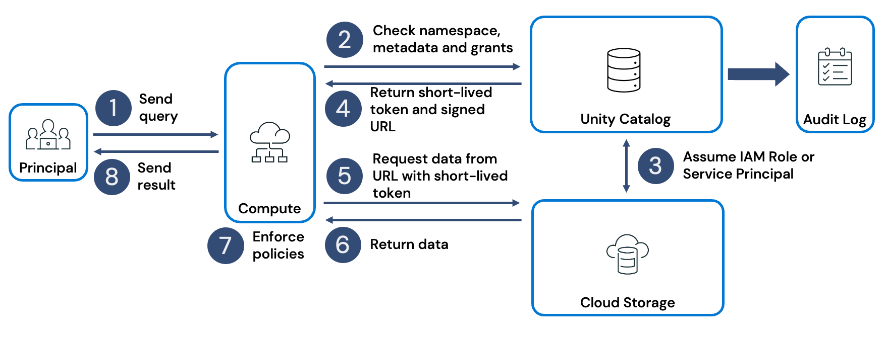
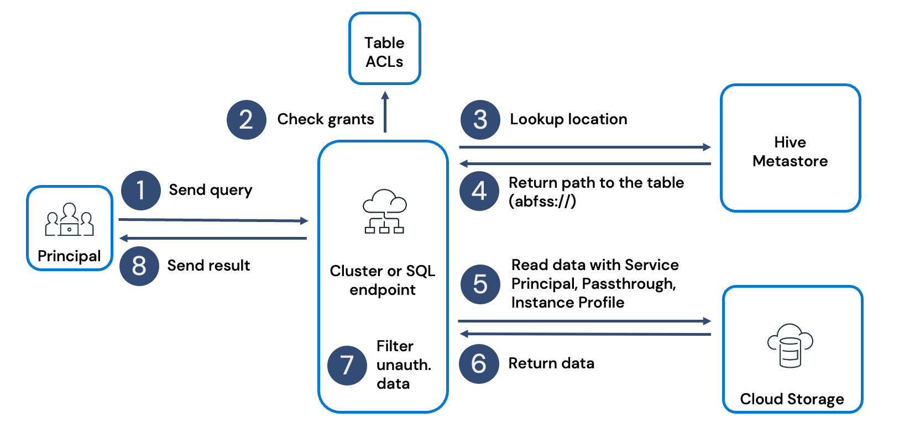

Let's examine how Unity Catalog manages query execution, with particular attention to security and administrative controls. We'll walk step by step through what happens when a query is submitted against a Unity Catalog table, covering the interactions between compute, the control plane, the data plane, and cloud storage. 

## The Query Lifecycle in Unity Catalog

The following diagram illustrates the overall flow of a query as it moves through different components in Unity Catalog.



### Step 1: Query submission

The lifecycle begins when a principal (a user or service identity) issues a query. Queries can originate in different ways:

* A data scientist might use an **all-purpose cluster** for interactive Python or SQL workloads.
* A **service principal** might run a scheduled pipeline or job on a **job cluster**.
* A **data analyst** might send a query through **Databricks SQL**, using a SQL warehouse.
* A **business intelligence (BI) tool** connected to a SQL warehouse could also generate the request.

In each case, the compute resource—cluster or warehouse—receives the query and begins execution.

### Step 2: Request validation in Unity Catalog

The compute resource forwards the request to **Unity Catalog**. Unity Catalog acts as the control plane for security and governance. It records the request in the **audit log** and checks whether the principal has the necessary permissions to access the objects referenced in the query. If permissions are denied, the query is blocked and the denial is logged. If access is granted, the request moves forward.

### Step 3: Assuming cloud credentials

For every object referenced in the query, Unity Catalog assumes the appropriate **cloud credential** associated with that object. These credentials are configured by a cloud administrator.

* For **managed tables**, the credential typically points to the cloud storage tied to the Unity Catalog metastore.
* For **external tables or files**, the credential corresponds to an external location governed by a defined storage credential.

> [!NOTE]
> In Azure, the preferred way to grant Unity Catalog access to Azure Data Lake Storage (ADLS Gen2) is via a **Managed Identity + Access Connector** (versus relying purely on service principals). They have the benefit of allowing Unity Catalog to access storage accounts protected by network rules, which isn’t possible using service principals, and they remove the need to manage and rotate secrets.

### Step 4: Issuing scoped tokens

Once credentials are validated, Unity Catalog generates a **scoped temporary access token** for each object. Along with the token, it provides a secure access URL. This allows the compute resource to read directly from storage without exposing long-lived credentials.

### Step 5: Data access from storage

The compute resource (cluster or SQL warehouse) uses the token and URL provided by Unity Catalog to request data directly from the underlying ADLS Gen2 endpoints (via `abfss://` or `dfs.core.windows.net` URL)

> [!NOTE]
> If your ADLS account has firewall or virtual network restrictions, you must explicitly allow the Azure Databricks access connector / managed identity to access the storage (in addition to allowing the compute nodes). If the storage account is locked down, even a valid token may be rejected if the identity is not allowed via firewall rules.

### Step 6: Data transfer

Cloud storage returns the requested data to the compute resource. This process is repeated for every object referenced in the query.

### Step 7: Fine-grained filtering

Unity Catalog enables partition-level access, but **final row- and column-level filters** are enforced on the compute resource itself. This ensures that principals only see the exact subset of data they're entitled to access.

- **Partition-level filtering** is enforced during query planning. Unity Catalog determines which partitions of a table a principal is allowed to access and prunes away the rest before data is retrieved from storage. This means that only the authorized portions of data are even scanned, improving both security and performance.

- **Row-level filtering** introduces conditions that are evaluated at query execution time inside the compute engine. Even though the underlying storage system may return a broader dataset, Unity Catalog ensures that only the rows matching the defined conditions are made visible to the requesting principal. This allows multiple users to query the same table but each receive a personalized, restricted view of the data. A row filter function is basically a predicate (a SQL expression or user-defined function) that is evaluated during query execution. In the following example, a row filter function is defined so that only members of the admin group can see all rows, while everyone else is restricted to rows where the region is `US`, and this filter is applied to the `sales` table:

```sql
CREATE FUNCTION us_filter(region STRING)
RETURN IF(IS_ACCOUNT_GROUP_MEMBER('admin'), true, region='US');

CREATE TABLE sales (region STRING, id INT)
WITH ROW FILTER us_filter ON (region);
```

- **Column-level filtering** operates similarly but at the attribute level. Specific columns can be masked or transformed so that sensitive information is hidden or anonymized, depending on the privileges of the principal. This makes it possible to share datasets broadly while ensuring that confidential fields are only fully visible to those with appropriate authorization. In the following example, a masking function is defined to hide Social Security numbers from anyone outside the HumanResourceDept group, and the function is applied to the `ssn` column of the `users` table so that unauthorized users only see masked values.

```sql
CREATE FUNCTION ssn_mask(ssn STRING)
  RETURN CASE WHEN IS_ACCOUNT_GROUP_MEMBER('HumanResourceDept') THEN ssn ELSE '***-**-****' END;

CREATE TABLE users (
  name STRING,
  ssn STRING MASK ssn_mask);
```

### Step 8: Returning the result

The filtered query result is returned from the compute resource to the calling user, job, or application.

## How Queries Work with Apache Hive

Unity Catalog was designed to streamline governance, but it also maintains compatibility with the legacy Hive metastore. When a workspace is assigned to a Unity Catalog metastore, Hive appears as a special catalog named **hive_metastore**. Tables stored there can still be queried by referencing this catalog in the namespace.

> [!NOTE]
> Hive metastore table access control is a legacy data governance model. 

The lifecycle of a query against a Hive table differs from Unity Catalog in several ways:

* Hive doesn't provide centralized, fine-grained governance. Instead, administrators often need to manage **service accounts, secrets, or instance profiles** for authentication and authorization.
* Access to data may involve setting up **mount points, passthrough authentication, or storage policies**, each requiring additional configuration.
* Audit logging and access controls are less integrated compared to Unity Catalog, which can lead to inconsistencies in security enforcement.



### Step 1: Query submission

A principal (user or service) sends a query to a cluster or SQL endpoint. This is the starting point for all Hive queries.

### Step 2: Access check

The cluster checks the query against **table access control lists (ACLs)**. These ACLs determine whether the requesting principal has the right to access the specified table.

### Step 3: Location lookup

If access is granted, the cluster consults the **Hive metastore** to find the storage location of the table. The metastore contains metadata about tables, including their schemas and storage paths.

### Step 4: Path returned

The Hive metastore returns the **storage path** to the cluster, usually as a URI (for example, `abfss://...`). This path points to the physical location of the table data in cloud storage.

### Step 5: Data request

The cluster attempts to read data from the cloud storage. At this stage, it must authenticate using one of several mechanisms, such as a **service principal, passthrough authentication, or an instance profile**. Administrators often need to configure these credentials in advance, along with secrets and mount points.

### Step 6: Data returned

Cloud storage sends the requested data back to the cluster.

### Step 7: Enforcement of policies

The cluster enforces any last-mile filtering to remove data the principal shouldn't see. This may involve applying row- or column-level restrictions at query time.

### Step 8: Result delivery

The final query result is sent back to the principal who issued the request.

In practice, this means querying Hive involves more manual administrative steps and ongoing maintenance. Unity Catalog reduces this overhead by automating credential handling, providing scoped tokens, and enforcing policies consistently across all objects.